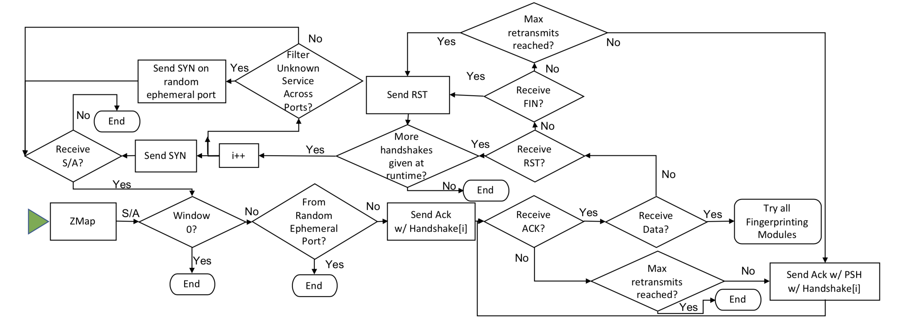

LZR
=========

LZR detects and fingerprint unexpected services running on unexpected ports by working with [ZMap](https://github.com/zmap/zmap). LZR can detect up 18 unique protocols simoultaneously with just two extra packets and can fingerprint over 35 different protocols. LZR can make ZGrab perform 55x faster while discovering 50% of services that running 35 unique Layer 7 handshakes can discover.

To learn more about how LZR's system and performance read this (coming soon).

## Building

Install and set up ZMap (see https://github.com/zmap/zmap). If also performing full L7 handshakes, set up ZGrab (https://github.com/zmap/zgrab2).

Set up `$GOPATH` (see https://golang.org/doc/code.html).
```
$ go get github.com/stanford-esrg/lzr
$ cd $GOPATH/src/github.com/stanford-esrg/lzr
```

LZR intercepts connections which ZMap opens; in order to ensure that the kernel does not interfere with LZR, LZR requires a source-ip to be specified for which the kernel drops all RSTs for traffic targeted to the source-ip. The chosen source-ip&mdash;which both ZMap and LZR will use&mdash;should be passed in as a parameter to make, so the appropriate iptables rule can be set.
```
$ make all source-ip=256.256.256.256/32
```

## Usage

To fingerprint unexpected services on an random port (9002):

```
sudo zmap --target-port=9002 --output-filter="success = 1 && repeat = 0" \
-f "saddr,daddr,sport,dport,seqnum,acknum,window" -O json --source-ip=$source-ip | \
sudo ./lzr --handshakes http,tls
```

To complete full L7 handshakes of unexpected services on an random port (9002):

```
sudo zmap --target-port=9002 --output-filter="success = 1 && repeat = 0" \
-f "saddr,daddr,sport,dport,seqnum,acknum,window" -O json --source-ip=$source-ip | \
sudo ./lzr --handshakes wait,http,tls -feedZGrab | \
zgrab multiple -c etc/all.ini 
```

## Flags
```
$ ./lzr --help

Usage of ./lzr:
  -cpuprofile string
    	write cpu profile to file
  -d	debug printing on
  -f string
    	json file name (default "default_20200802194843.json")
  -feedZGrab
    	send to zgrab ip and fingerprint
  -forceAllHandshakes
    	Complete all handshakes even if data is returned early on. This also turns off HyperACKtive filtering.
  -haf
    	HyperACKtive filtering off (default true)
  -handshakes string
    	handshakes to scan with (default "http")
  -memprofile string
    	write memory profile to this file
  -priorityFingerprint string
    	fingerprint to prioritize when multiple match
  -pushDataOnly
    	Don't attach data to ack but rather to push only
  -rn int
    	number of data packets to re-transmit (default 1)
  -rt int
    	number of seconds until re-transmitting packet (default 1)
  -t int
    	number of seconds to wait in timeout queue for last retransmission (default 5)
  -w int
    	number of worker threads for each channel (default 1)
```

#### Caveats for specific features
HyperACKtive Note: If a host responds both on the expected port and on the random ephemeral port, whichever response comes first will dictate whether the host is marked as HyperACKtive. The expected port is contacted first, so unless there is some congestion which causes the packets to be delivered out of order, then the expected port is expected to answer first.  

## LZR's Algorithm



